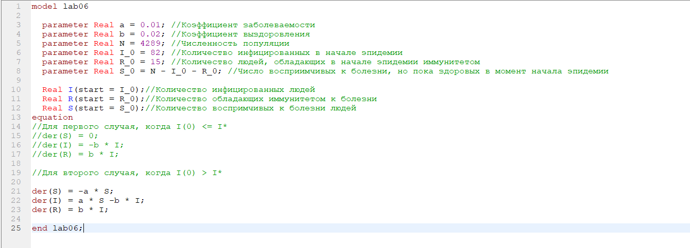
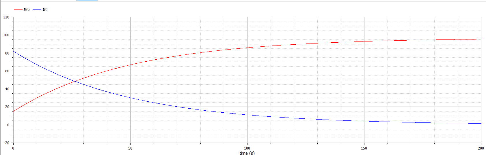
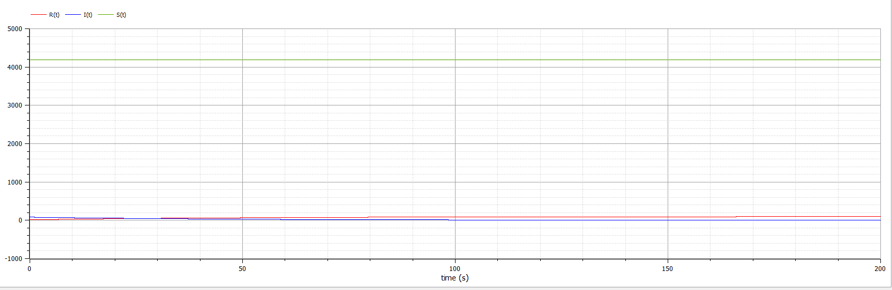
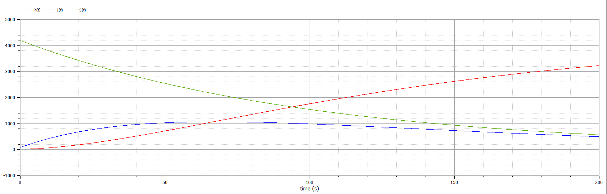

---
# Front matter
lang: ru-RU
title: "Лабораторная работа №6. Вариант 50."
subtitle: "Модель эпидемии"
author: "Силкина Мария Александровна"

# Formatting
toc-title: "Содержание"
toc: true # Table of contents
toc_depth: 2
lof: true # List of figures
lot: true # List of tables
fontsize: 12pt
linestretch: 1.5
papersize: a4paper
documentclass: scrreprt
polyglossia-lang: russian
polyglossia-otherlangs: english
mainfont: PT Serif
romanfont: PT Serif
sansfont: PT Sans
monofont: PT Mono
mainfontoptions: Ligatures=TeX
romanfontoptions: Ligatures=TeX
sansfontoptions: Ligatures=TeX,Scale=MatchLowercase
monofontoptions: Scale=MatchLowercase
indent: true
pdf-engine: lualatex
header-includes:
  - \linepenalty=10 # the penalty added to the badness of each line within a paragraph (no associated penalty node) Increasing the value makes tex try to have fewer lines in the paragraph.
  - \interlinepenalty=0 # value of the penalty (node) added after each line of a paragraph.
  - \hyphenpenalty=50 # the penalty for line breaking at an automatically inserted hyphen
  - \exhyphenpenalty=50 # the penalty for line breaking at an explicit hyphen
  - \binoppenalty=700 # the penalty for breaking a line at a binary operator
  - \relpenalty=500 # the penalty for breaking a line at a relation
  - \clubpenalty=150 # extra penalty for breaking after first line of a paragraph
  - \widowpenalty=150 # extra penalty for breaking before last line of a paragraph
  - \displaywidowpenalty=50 # extra penalty for breaking before last line before a display math
  - \brokenpenalty=100 # extra penalty for page breaking after a hyphenated line
  - \predisplaypenalty=10000 # penalty for breaking before a display
  - \postdisplaypenalty=0 # penalty for breaking after a display
  - \floatingpenalty = 20000 # penalty for splitting an insertion (can only be split footnote in standard LaTeX)
  - \raggedbottom # or \flushbottom
  - \usepackage{float} # keep figures where there are in the text
  - \floatplacement{figure}{H} # keep figures where there are in the text
---

# Цель работы

Изучить простейшую модель эпидемии, которая отражает картину протекания болезни. 

# Задачи

1. Построить графики изменения числа особей в каждой группе.

2. Рассмотреть как эпидемия будет протекать в случаях : $$ I(0) \leq I^{*} $$  и  $$ I(0) > I^{*} $$ .

# Теоретическое введение

Модель эпидемии  имеет следующий вид:

Для построения модели скорости изменения числа восприимчивых, но еще здоровых особей:
	$$ 
	\frac{dS}{dt} =
                \begin{cases}
                    \  - \alpha S, I(t) >  I^{*} 
                    \\
                    \ 0,  I(t) \leq I^{*} 
                 \end{cases}
        $$

Для построения модели скорости изменения числа инфицированных особей:
	$$ 
	\frac{dI}{dt} =
                \begin{cases}
                    \  - \alpha S - \beta I, I(t) >  I^{*} 
                    \\
                    \ - \beta I,  I(t) \leq I^{*} 
                 \end{cases}
        $$

Для построения модели скорости изменения выздоравливающих особей:
	$$ 
	\frac{dR}{dt} =  - \beta I    
        $$

где 
$\alpha$ - коэффициент заболеваемости;

$\beta$  - коэффициент выздоровления;

$I$ - количество инфицированных особей;

$R$ - количество выздоравливающих особей;

$S$- количество восприимчивых особей.

# Выполнение лабораторной работы

## Код программы 

Код програмы написан на языке Modelica. 

model lab06
  
  parameter Real a = 0.01; //Коэффициент заболеваемости

  parameter Real b = 0.02; //Коэффициент выздоровления

  parameter Real N = 4289; //Численность популяции

  parameter Real I_0 = 82; //Количество инфицированных в начале эпидемии

  parameter Real R_0 = 15; //Количество людей, обладающих в начале эпидемии иммунитетом

  parameter Real S_0 = N - I_0 - R_0; //Число восприимчивых к болезни, но пока здоровых в момент начала эпидемии

  
  Real I(start = I_0);//Количество инфицированных людей

  Real R(start = R_0);//Количество обладающих иммунитетом к болезни

  Real S(start = S_0);//Количество воспримчивых к болезни людей

equation

//Для первого случая, когда I(0) <= I*

//der(S) = 0;

//der(I) = -b * I;

//der(R) = b * I;

//Для второго случая, когда I(0) > I*

der(S) = -a * S;

der(I) = a * S -b * I;

der(R) = b * I;

end lab06;

## Ход работы

Уравнения модели эпидемии  для моего варианта имеют следующий вид:

Для случая, когда $$I(0) \leq I^{*}$$ 

$$ \frac{dS}{dt} = 0$$

$$\frac{dI}{dt} =- \beta I$$

$$\frac{dR}{dt} =  - \beta I$$

Для случая, когда $$ I(0) > I^{*} $$ 

$$ \frac{dS}{dt} = - \alpha S$$

$$\frac{dI}{dt} = - \alpha S - \beta I$$

$$\frac{dR}{dt} =  - \beta I $$
	
Начальные условия: N = 4289, I(0) = 82, R(0) = 15, S(0) = 4192.

$\alpha = 0.01$, $\beta = 0.02$ и они являются постоянными.

Мною был написан код программы, который выводит графики, нужные в задачах. (рис 1. -@fig:001)  

{ #fig:001 width=70% }

Ниже приведен графики изменения количества выздоравливающих и инфицированных особей за временной промежуто для первого случая. (рис 2. -@fig:002)  

{ #fig:002 width=70% }

Также представлен отдельно график изменения всех трех групп особей, включая восприимчивых, но еще здоровых особей.  (рис 3. -@fig:003)  

{ #fig:003 width=70% }

Для второго случая выведен следующий график изменения численности.  (рис 4. -@fig:004)   

{ #fig:004 width=70% }

# Выводы

При выполнении данной лабораторной работы я изучила модель протекания эпидемии, выполнив задания, данные мне, а именно: построила графики изменения численности для двух случаев.